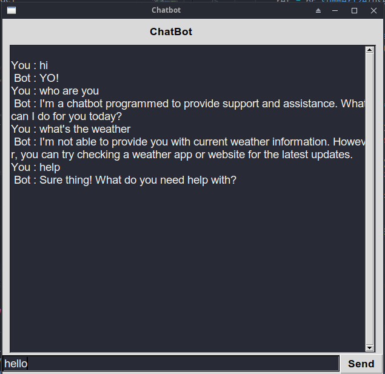

## ChatBot with GUI and BART Summarizer

This project is a ChatBot with a Graphical User Interface (GUI) that uses the BART (Bidirectional and AutoRegressive Transformer) model for summarizing text. The ChatBot can respond to user input in natural language and provide a summary of any text entered by the user.

> note! you need to provide API Key from huggingface in order to use BART

## Requirements

To run this project, you will need:

- Python 3.x
- tkinter library
- nltk library
- numpy library
- tensorflow library

## Installation

1. Clone this repository to your local machine.
2. Install the required libraries using pip:

bash

`pip install tkinter pip install nltk pip install numpy pip install tensorflow`

3. Open the `main.py` file and run it using Python.

## Usage

1. Type a message in the text box and press Send button to send it to the ChatBot.
2. The ChatBot will respond with a message based on its NLP algorithms.
3. Start your messge with '&' to summerize your large paragraph

## Features

The ChatBot with GUI and BART Summarizer has the following features:

- Graphical User Interface (GUI) for easy user interaction
- Natural language processing (NLP) for understanding and responding to user input
- BART summarizer for generating summaries of any text entered by the user

## Credits

This project was developed by me personal project. The BART summarizer was adapted from the Hugging Face Transformers library: https://huggingface.co/transformers/

## Screenshot

